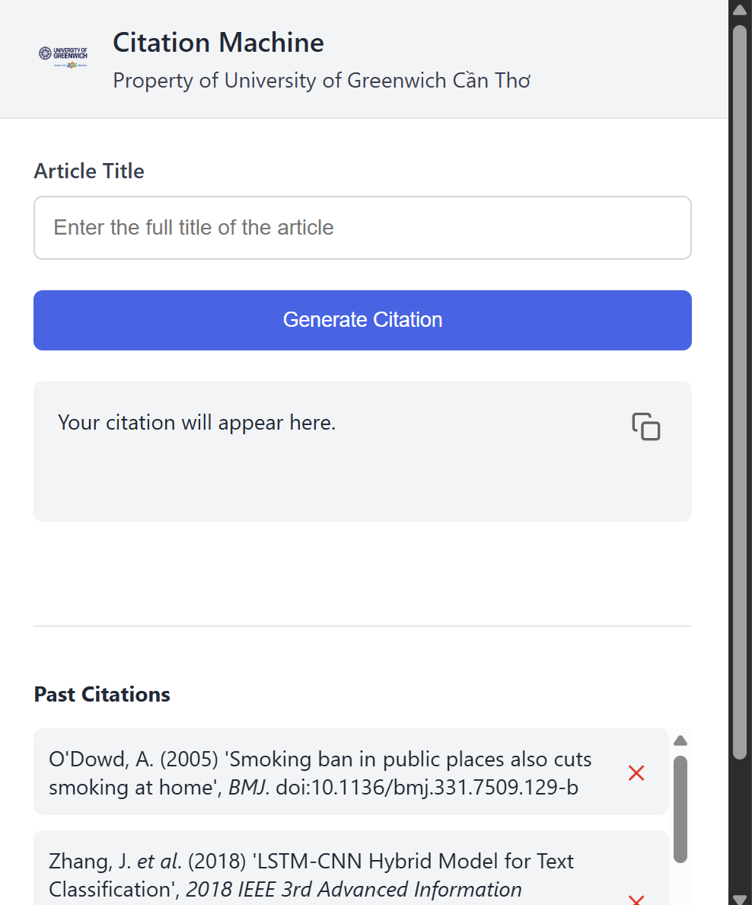

# 📚 Harvard Citation Generator (Chrome Extension)

A browser extension that automatically generates accurate Harvard-style academic citations based on the article title, following the **University of Greenwich** citation format.

Built using the [Crossref API](https://api.crossref.org), this extension fetches metadata and formats it for easy copying, saving, and reuse.

---

## 🎯 Features

- 🔍 Search article metadata by title using Crossref
- 📝 Formats citation according to University of Greenwich's Harvard guidelines
- 📋 Copy citation to clipboard with one click
- 💾 Save citations locally and manage them inside the extension
- 🧹 Easily delete duplicates or outdated entries
- 🏫 Branded interface with University of Greenwich Cần Thơ logo

---

## 🛠 Installation

1. **Clone or Download** this repository.
2. Open **Google Chrome** and go to `chrome://extensions/`
3. Enable **Developer Mode** (top right).
4. Click **"Load unpacked"** and select the project folder.
5. The extension should now appear in your toolbar.

---

## 🖼 UI Preview

  
*(Branded with University of Greenwich Cần Thơ)*

---

## 🔍 How It Works

1. Enter an article title in the input field.
2. Click **"Generate Citation"**
3. The citation is displayed in the output box in this format:

   `Author, A. and Author, B. (Year) 'Title of Article', *Journal Name*. doi:DOI`

4. You can:
   - Copy it to your clipboard
   - Save it locally
   - Manage all past citations in a scrollable list

---

## 📁 Project Structure

    .
    ├── manifest.json         # Chrome Extension metadata
    ├── popup.html            # User interface
    ├── popup.js              # UI logic + citation saving
    ├── backend.js            # Fetch + format citation using Crossref API
    ├── style.css             # Styling for popup
    ├── images/
    │   ├── icon16.png
    │   ├── icon48.png
    │   ├── icon128.png
    │   └── school-logo.png

---

## 🧰 Technologies Used

- HTML, CSS, JavaScript
- Chrome Extensions API (Manifest v3)
- [Crossref REST API](https://api.crossref.org)
- LocalStorage (for saved citations)

---

## 🔐 Permissions

The extension only requires:

- `clipboardWrite` — to enable copying citations

---

## 📜 License

This project is released for academic and personal use under the **MIT License**.

---

## 👤 Author

Duy Anh Nguyen
GitHub: https://github.com/KatoTheFluffyWolf

> For inquiries or collaboration, feel free to open an issue or fork this repo.
